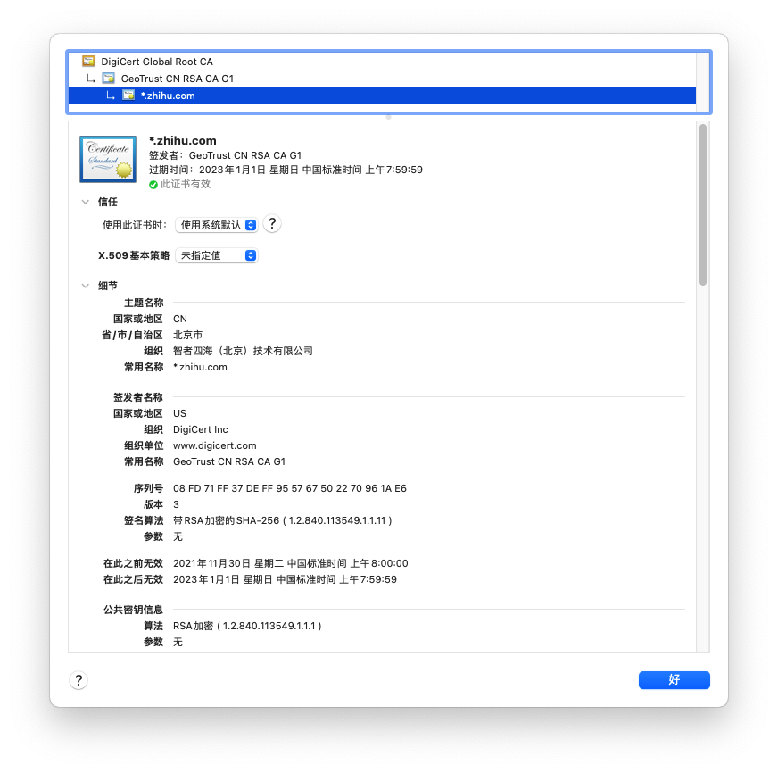

# HTTPS

本文主要参考[彻底搞懂HTTPS的加密原理](https://zhuanlan.zhihu.com/p/43789231)，此文章完整的阐述了HTTPS的原理。

## 基础知识

具体可查看[加密算法](../../算法/加密算法)

### 对称加密

即加密和解密使用同一密钥。

### 非对称加密

有两把密钥，公钥和私钥，公钥加密的文件，只有私钥才能解密，同时，私钥加密的内容也只有公钥才能解密。

- 一般公钥加密，私钥解密，解决的是数据加密传输问题
- 私钥加密，公钥解密，解决的是明确数据来源问题

特点：

- 公钥可以公开的传递
- 加密速度慢

## 可以使用对称加密吗

对称加密最大的问题就是怎么把密钥传递给对方，显示生活中，可以两个人约定线下见面，手把手递给他密码本，但是，信息在互联网中中传递，就仿佛一个人在大街裸奔，毫无安全可言，所以对称加密无法解决安全传递密钥的问题。

## 可以用非对称加密吗

非对称加密最大的特点就是有公钥和私钥，公钥可以公开。

那么服务器可以生成公钥私钥对，并将公钥明文传递给客户端，客户端使用公钥对数据进行加密，然后服务器收到后，根据私钥进行解密，由于公钥是公开的，所以服务端无法使用私钥进行加密给客户端，所以这只解决客户端到服务端的通信安全。

反过来，同样的道理，客户端也生成公钥私钥对，将公钥传递给服务器，服务器使用公钥加密，客户端使用对应的私钥解密，这样就保证了客户端到服务端的通信安全。

但是，非对称加密加密速度很慢，如果数据量很大，会造成很大的性能损失。

## 非对称加密+对称加密

既然非对称加密速度很慢，那么我们可以是否可以将对称加密和非对称加密结合呢？

1. 服务器生成有非对称公钥`A`，私钥`A'`
2. 浏览器向服务器请求，服务器将公钥`A`明文传输给浏览器
3. 浏览器使用这个公钥对对称加密密钥对`X`进行加密，并传递给服务器
4. 服务器通过私钥`A'`解密后就获得了明文`X`
5. 双方使用`X`对称加密进行数据传输

看似没啥问题了，但是还存在中间人攻击漏洞。

## 中间人攻击

1. 某网站有用于非对称加密的公钥`A`、私钥`A'`
2. 浏览器向网站服务器请求，服务器把公钥A明文给传输浏览器
3. 中间人劫持到公钥`A`，保存下来，把数据包中的公钥`A`替换成自己伪造的公钥`B`（它当然也拥有公钥B对应的私钥`B'`）
4. 浏览器生成一个用于对称加密的密钥`X`，用公钥`B`（浏览器无法得知公钥被替换了）加密后传给服务器
5. 中间人劫持后用私钥`B'`解密得到密钥`X`，再用公钥`A`加密后传给服务器
6. 服务器拿到后用私钥`A'`解密得到密钥`X`

那么上述问题的核心问题就是客户端无法确认自己拿到的公钥就是真正的服务端的公钥，也就是服务端的身份问题。

可不可以让服务端给出它的唯一标识，及摘要，客户端对这个摘要进行认证？

例如SSH协议，客户端拿到公钥的SHA值之后，用户可以用这个值与服务方在公开渠道提供的摘要进行对比，来确定服务端的身份问题。

Linux的ssh工具在第一次建立通信之后，可选择的将对方服务器公钥的SHA值存储到`~/.ssh/known_hosts`中，如果后续此host的摘要发生变化，则发出中间人攻击的告警。

但这种方案无法自动鉴别对方身份，那么能不能有一种像身份证一样的自带防伪的东西呢？

这就是CA证书，即CA机构颁发的数字证书。

## 数字证书

点此查看[数字证书类型]()。

网站在使用HTTPS前，需要向CA机构申请一份数字证书，数字证书里含有证书持有者信息。客户端就可以知道对方正是我要通信的对象。

如下图，知乎的数字证书：

身份证有一系列防伪手段来防伪，那么数字证书如何防伪呢？

## 证书防伪

我们可以生成证书的签名，通过对比证书的签名和我们生成的签名是否一致来判断证书是否被篡改。

制作数字签名：

1. CA机构拥有非对称加密的私钥和公钥。
2. CA机构对证书明文数据T进行hash。
3. 对hash后的值用私钥加密，得到数字签名S。

明文和数字签名共同组成了数字证书，这样一份数字证书就可以颁发给网站了。

浏览器验证过程：

1. 拿到证书，得到明文`T`，签名`S`
2. 用CA机构的公钥对`S`解密（由于是浏览器信任的机构，所以浏览器保有它的公钥。详情见下文），得到`S'`
3. 用证书里指明的hash算法对明文`T`进行hash得到`T'`
4. 显然通过以上步骤，`T'`应当等于`S'`，除非明文或签名被篡改。所以此时比较`S'`是否等于`T'`，等于则表明证书可信

**中间人有可能篡改该证书吗？**

假设中间人篡改了证书的原文，由于他没有CA机构的私钥，所以无法得到此时加密后签名，无法相应地篡改签名。浏览器收到该证书后会发现原文和签名解密后的值不一致，则说明证书已被篡改，证书不可信，从而终止向服务器传输信息，防止信息泄露给中间人。

既然不可能篡改，那整个证书被掉包呢？

**中间人有可能把证书掉包吗？**

假设有另一个网站B也拿到了CA机构认证的证书，它想劫持网站A的信息。于是它成为中间人拦截到了A传给浏览器的证书，然后替换成自己的证书，传给浏览器，之后浏览器就会错误地拿到B的证书里的公钥了，这确实会导致上文“中间人攻击”那里提到的漏洞？

其实这并不会发生，因为证书里包含了网站A的信息，包括域名，浏览器把证书里的域名与自己请求的域名比对一下就知道有没有被掉包了。

## 证明CA机构的公钥是可信的

操作系统、浏览器本身会预装一些它们信任的根证书，如果其中会有CA机构的根证书，这样就可以拿到它对应的可信公钥了。

实际上证书之间的认证也可以不止一层，可以A信任B，B信任C，以此类推，我们把它叫做`信任链`或`数字证书链`。也就是一连串的数字证书，由根证书为起点，透过层层信任，使终端实体证书的持有者可以获得转授的信任，以证明身份。

当你遇到浏览器提示需安装证书的情况，这里安装的就是根证书。说明浏览器不认给这个网站颁发证书的机构，那么你就得手动下载安装该机构的根证书。

## 其他

### **每次进行HTTPS请求时都**必须经过上述步骤吗？

服务器会为每个浏览器（或客户端软件）维护一个session ID，在TLS握手阶段传给浏览器，浏览器生成好密钥传给服务器后，服务器会把该密钥存到相应的session ID下，之后浏览器每次请求都会携带session ID，服务器会根据session ID找到相应的密钥并进行解密加密操作，这样就不必要每次重新制作、传输密钥了。

## References

1. https://zhuanlan.zhihu.com/p/43789231
1. https://superuser.com/questions/1507193/what-does-this-ssh-message-mean-the-authenticity-of-host-cant-be-establis