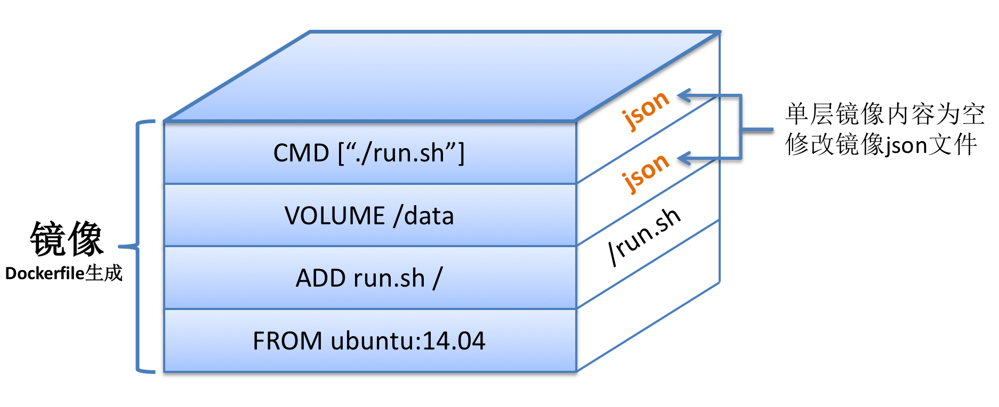

# Docker

## 什么是Docker

Docker 是一个开源的应用容器引擎，Docker可以让开发者打包他们的应用以及依赖包到一个轻量级、可移植的容器中，然后发布到任何流行的 Linux 机器上。

本文基于CentOS7 安装Docker。

## 安装Docker

- 卸载旧版本

  较旧的 Docker 版本称为 docker 或 docker-engine

  ```
  $ sudo yum remove docker \
                    docker-client \
                    docker-client-latest \
                    docker-common \
                    docker-latest \
                    docker-latest-logrotate \
                    docker-logrotate \
                    docker-engine
  ```

- 使用官方安装脚本自动安装

  ```
  $ curl -fsSL https://get.docker.com | bash -s docker --mirror Aliyun
  ```

  也可以使用国内 daocloud 一键安装命令：

  ```
  $ curl -sSL https://get.daocloud.io/docker | sh
  ```

- 查看Docker状态

  ```
  $ systemctl status docker
  ```

- 启动Docker

  ```
  $ systemctl start docker
  ```

- 重启Docker

  ```
  $ systemctl daemon-reload
  $ systemctl restart docker
  ```

- 关闭docker 

  ```
  $ systemctl stop docker
  ```

- 查看是否启动成功

  ```
  $ docker ps -a
  ```
  
- 查看日志

  ```
  $ docker logs CONTAINER ID(容器id)
  ```

## Docker架构

Docker 包括三个基本概念:

- **镜像（Image）**：Docker 镜像（Image），就相当于是一个 root 文件系统。比如官方镜像 ubuntu:16.04 就包含了完整的一套 Ubuntu16.04 最小系统的 root 文件系统。
- **容器（Container）**：镜像（Image）和容器（Container）的关系，就像是面向对象程序设计中的类和实例一样，镜像是静态的定义，容器是镜像运行时的实体。容器可以被创建、启动、停止、删除、暂停等。
- **仓库（Repository）**：仓库可看成一个代码控制中心，用来保存镜像。

容器与镜像的关系类似于面向对象编程中的对象与类。

## Docker镜像加速器

查看docker镜像

```
$ docker info
```

配置阿里云镜像

```
$ sudo mkdir -p /etc/docker

{
  "registry-mirrors": ["https://afi5x6i2.mirror.aliyuncs.com"]
}
EOF
$ sudo systemctl daemon-reload
$ sudo systemctl restart docker
```

## Dorker镜像相关命令

- 查看本地所有镜像

  ```
  $ docker images
  ```

- 从网络查找相关镜像

  ```
  $ docker search 镜像名称
  ```

- 拉取镜像

  ```
  $ docker pull mysql:5.7
  ```

  从Docker仓库下载镜像到本地，镜像名称格式为 名称:版本号，如果版本号不指定则是最新的版本

- 删除本地镜像

  ```
  $ docker rmi 镜像id   //i(image)
  ```
  
- `tag`

  给镜像打标签，例如给Hello word镜像：
  
  ```
  $ docker images
  hello-world                     latest    feb5d9fea6a5   9 months ago    13.3kB
  ...
  ```
  
  打一个标签：
  
  ```
  $ docker tag hello-world uat-xxx:81/data/hello-world:v4
  ```
  
  结果：
  
  ```
  $ docker images
  hello-world                     latest    feb5d9fea6a5   9 months ago    13.3kB
  hello-world                     v1        feb5d9fea6a5   9 months ago    13.3kB
  ...
  ```
  
- `push`

  ```
  $ docker push hub.giao.com/hamburger/tomcat:v1.0
  ```
  
  

## Docker容器相关命令

- 查看正在运行的容器

  ```
  $ docker ps 
  ```

- 查看所有容器

  ```
  $ docker ps -a
  ```

- 新建容器

  ```
  $ docker run 参数
  $ docker run -it --name=c1 centos:7 /bin/bash #交互式容器
  $ docker run -id --name=c2 centos:7  #守护式容器
  ```

  新建mysql容器

  ```
  $ docker run -it --name=mysql mysql:5.7 /bin/bash
  ```

- 进入容器

  ```
  $ docker exec -it mysql /bin/bash 
  ```

- 启动容器

  ```
  $ docker start 容器名称
  ```

- 关闭容器

  ```
  $ docker stop 容器名称
  ```

- 删除容器：如果容器是运行状态则删除失败，需要停止容器才能删除

  ```
  $ docker rm 容器名称
  ```

- 查看容器信息（IP）

  ```
  $ docker inspect 容器名称
  ```

- 容器开机自启动

  ```
  $ docker update --restart=always 容器名|容器ID
  ```

- 目录挂载

  ```
  $ docker run -id --name=容器名 -v 宿主机的目录:容器的目录 镜像名:镜像版本
  ```

## dockerfile

制作镜像的两种方式，一种是将容器提交为镜像

```
$ docker commit 容器ID|容器名 镜像名:镜像版本
```

手动编写dockerfile

- FROM

  基础镜像是谁

- MAINTAINER

  作者是谁

- RUN

  准备执行哪些LINUX命令

- WORKDIR

  登录容器进入的默认目录

- CMD

  容器启动后默认执行的命令

## docker IPV4转发问题

- WARNING: IPv4 forwarding is disabled. Networking will not work.

  没有开启转发,网桥配置完后，需要开启转发，不然容器启动后，就会没有网络，配置`/etc/sysctl.conf`,添加`net.ipv4.ip_forward=1`

  ```
  $ vim /etc/sysctl.conf
  
  #配置转发
  #检查系统设置，打开IPv4转发
  net.ipv4.ip_forward=1
  
  #重启网卡，让配置生效
  systemctl restart network
  
  #查看是否成功,如果返回为“net.ipv4.ip_forward = 1”则表示成功
  
  sysctl net.ipv4.ip_forward
  ```


## 为什么Docker镜像那么小

### 为什么Docker的centOS镜像那么小?

Linux操作系统分别由两部分组成

- 内核空间(kernel)

  Linux刚启动时会加载bootfs文件系统，之后bootf会被卸载掉

- 用户空间(rootfs)

  用户空间的文件系统是rootfs,包含常见的目录，如`/dev`、`/proc`、`/bin`、`/etc`等等

通过docker pull centos命令下载镜像，实质上下载centos操作系统的rootfs，因此docker下载的镜像大小只有200M

### 为什么Docker中的镜像那么小？例如HelloWord

通过docker build以上Dockerfile的时候，会在Ubuntu:14.04镜像基础上，添加三层独立的镜像，依次对应于三条不同的命令。镜像示意图如下：



不得不说，在层级化管理的Docker镜像中，有不少层大小都为0。那些镜像层大小`不为0`的情况，归根结底的原因是：构建Docker镜像时，对当前的文件系统造成了修改更新。而修改更新的情况主要有两种：

**1.ADD或COPY命令**:ADD或者COPY的作用是在docker build构建镜像时向容器中添加内容，只要内容添加成功，当前构建的那层镜像就是添加内容的大小，如以上命令`ADD run.sh /`，新构建的那层镜像大小为文件run.sh的大小。

**2.RUN命令**:RUN命令的作用是在当前空的镜像层内运行一条命令，倘若运行的命令需要更新磁盘文件，那么所有的更新内容都在存储在当前镜像层中。举例说明：`RUN echo DaoCloud`命令不涉及文件系统内容的修改，故命令运行完之后当前镜像层的大小为0；`RUN wget http://abc.com/def.tar`命令会将压缩包下载至当前目录下，因此当前这一层镜像的大小为:对文件系统内容的增量修改部分，即def.tar文件的大小。

#### 镜像复用

假设本地镜像存储中只有一个ubuntu:14.04的镜像，我们以两个Dockerfile来说明镜像复用：

```
FROM ubuntu:14.04
RUN apt-get update
```

```
FROM ubuntu:14.04
ADD compressed.tar /
```

假设最终docker build构建出来的镜像名分别为image1和image2，由于两个Dockerfile均基于ubuntu:14.04，因此，image1和image2这两个镜像均复用了镜像ubuntu:14.04。 假设`RUN apt-get update`修改的文件系统内容为20MB，最终本地三个镜像的大小关系应该如下：

**ubuntu:14.04**: 200MB

**image1**:200MB(ubuntu:14.04)+20MB=220MB

**image2**:200MB(ubuntu:14.04)+100MB=300MB

如果仅仅是单纯的累加三个镜像的大小，那结果应该是：200+220+300=720MB，但是由于镜像复用的存在，实际占用的磁盘空间大小是：200＋20+100=320MB，足足节省了400MB的磁盘空间。在此，足以证明镜像复用的巨大好处。

## docker使用问题

#### 容器时区

问题：docker日志时间比正常时间慢8个小时

```
root@9cdee1317100:/# date
Thu Dec 17 07:32:57 UTC 2020
```

UTC为标准时间，为格林威治时间

原因：宿主机设置了时区，但是Docker容器并未设置时区

解决：

- 运行容器时指定时区 

  ```
  docker run -d -p 5672:5672 -p 15672:15672 -v /etc/timezone:/etc/timezone:ro -v /etc/localtime:/etc/localtime:ro  --name rabbitmq rabbitmq:management
  ```

  之后显示时间是正常的，这时候就是中国时间CST了，即东八区

  ```
  # date
  Thu Dec 17 15:37:31 CST 2020
  ```

- 修改Dockerfile文件，在里面设置时区（未测试）

  ```
  ENV TZ=Asia/Shanghai 
  RUN ln -snf /usr/share/zoneinfo/$TZ /etc/localtime && echo $TZ > /etc/timezone
  ```

## References

1. https://blog.csdn.net/shlazww/article/details/47375009
