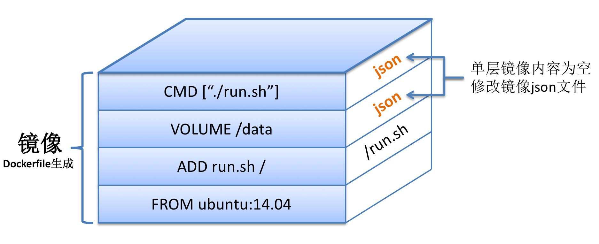

# Docker

## 什么是Docker

Docker 是一个基于Go语言实现的开源容器项目，Docker的构想是"Build, Ship and Run Any App, Anywhere"，即通过对应用的封装，分发，部署，运行生命周期进行管理，达到应用组件级别的"一次封装，到处运行"。

Docker可以理解为一种轻量级的沙盒，每个容器内运行着一个应用，不同的容器相互隔离，容器之间也可以通过网络相互通信。容器的创建和停止十分迅速，几乎和创建和终止原生应用一致，容器自身对系统资源的额外需求也十分有限，远低于传统虚拟机，很多时候可以直接把容器当成应用本身。

## Docker核心概念

Docker三大核心概念:

- Docker镜像（Image）

  可以理解为一个只读的模板，例如一个Apache镜像包含了一个基本的操作系统环境，里面仅安装了Apache应用程序。

- Docker容器（Container）

  容器是从镜像创建的应用实例，它可以启动、开始、停止、删除，这些容器都是相互隔离，互不可见的。

- Docker仓库（Repository）

  仓库是Docker集中存放镜像文件的场所。

  根据所存储的镜像公开分享与否，Docker仓库可以分为公开仓库和私有仓库，最大的公开仓库是官方提供的Docker Hub，用户也可以在本地网络内创建一个只能自己访问的私有仓库。

## Docker数据卷

数据卷（Docker Volumes）是一个可供容器使用的特殊目录，它将宿主机目录直接映射进容器，类似Linux的mount行为。

- 数据卷可以在容器之间共享和重用，容器间传递数据将变得高效与方便
- 对数据卷的修改会马上生效，无论是容器内操作还是宿主机操作
- 对数据卷的更新不会影响镜像，应用和数据上解耦的

可以通过volume子命令来管理数据卷：

```
$ docker volume create -d local test
```

此时，在`/var/lib/docker/volumes`路径下，会发现所创建的数据卷test。

查看所有数据卷：

```
$ docker volume ls
```

查看某个数据卷的详细信息：

```
$ docker volume inspect myvolume
```

还可以在创建容器的时候来绑定数据卷，通过`docker run -mount`选项来使用数据卷：

`-mount`选项支持三种类型的数据卷，包括：

- volume

  普通数据卷，映射到主机`/var/lib/docker/volumes`路径下。

- bind

  绑定数据卷，映射到主机指定路径下。

- tmpfs

  临时数据卷，只存在于内存中。

例如：

使用`training/webapp`镜像创建一个Web容器，并创建一个数据卷挂载到容器的`/opt/webapp`目录：

```
$ docker run -d -P --name web --mount type=bind,source=/webapp,destination=/opt/webapp training/webapp python app.py
```

等同于：

```
$ docker run -d -P --name web -v /webapp:/opt/webapp training/webapp python app.py
```

注意：

- `-v`左侧是宿主机目录，右边是容器内目录。
- 本地目录的路径必须是绝对路径，容器内路径可以为相对路径，如果宿主目录不存在，Docker会自动创建。
- 如果没有指定宿主机目录，那么将自动在`/var/lib/docker/volumes`下创建随机目录
- 如果宿主机上指定为相对路径，例如`test`，那么也会在`/var/lib/docker/volumes`下创建test目录

## Docker IPV4转发问题

- WARNING: IPv4 forwarding is disabled. Networking will not work.

  没有开启转发,网桥配置完后，需要开启转发，不然容器启动后，就会没有网络，配置`/etc/sysctl.conf`,添加`net.ipv4.ip_forward=1`

  ```
  $ vim /etc/sysctl.conf
  
  #配置转发
  #检查系统设置，打开IPv4转发
  net.ipv4.ip_forward=1
  
  #重启网卡，让配置生效
  systemctl restart network
  
  #查看是否成功,如果返回为“net.ipv4.ip_forward = 1”则表示成功
  
  sysctl net.ipv4.ip_forward
  ```


## 为什么Docker镜像那么小

### 为什么Docker的CentOS镜像那么小?

Linux操作系统分别由两部分组成

- 内核空间(kernel)

  Linux刚启动时会加载bootfs文件系统，之后bootfs会被卸载掉

- 用户空间(rootfs)

  用户空间的文件系统是rootfs,包含常见的目录，如`/dev`、`/proc`、`/bin`、`/etc`等等

通过docker pull centos命令下载镜像，实质上下载centos操作系统的rootfs，因此docker下载的镜像大小只有200M

### 为什么Docker中的镜像那么小？例如HelloWord

通过docker build以上Dockerfile的时候，会在Ubuntu:14.04镜像基础上，添加三层独立的镜像，依次对应于三条不同的命令。镜像示意图如下：



不得不说，在层级化管理的Docker镜像中，有不少层大小都为0。那些镜像层大小`不为0`的情况，归根结底的原因是：构建Docker镜像时，对当前的文件系统造成了修改更新。而修改更新的情况主要有两种：

**1.ADD或COPY命令**:ADD或者COPY的作用是在docker build构建镜像时向容器中添加内容，只要内容添加成功，当前构建的那层镜像就是添加内容的大小，如以上命令`ADD run.sh /`，新构建的那层镜像大小为文件run.sh的大小。

**2.RUN命令**:RUN命令的作用是在当前空的镜像层内运行一条命令，倘若运行的命令需要更新磁盘文件，那么所有的更新内容都在存储在当前镜像层中。举例说明：`RUN echo DaoCloud`命令不涉及文件系统内容的修改，故命令运行完之后当前镜像层的大小为0；`RUN wget http://abc.com/def.tar`命令会将压缩包下载至当前目录下，因此当前这一层镜像的大小为:对文件系统内容的增量修改部分，即def.tar文件的大小。

#### 镜像复用

假设本地镜像存储中只有一个ubuntu:14.04的镜像，我们以两个Dockerfile来说明镜像复用：

```
FROM ubuntu:14.04
RUN apt-get update
```

```
FROM ubuntu:14.04
ADD compressed.tar /
```

假设最终docker build构建出来的镜像名分别为image1和image2，由于两个Dockerfile均基于ubuntu:14.04，因此，image1和image2这两个镜像均复用了镜像ubuntu:14.04。 假设`RUN apt-get update`修改的文件系统内容为20MB，最终本地三个镜像的大小关系应该如下：

**ubuntu:14.04**: 200MB

**image1**:200MB(ubuntu:14.04)+20MB=220MB

**image2**:200MB(ubuntu:14.04)+100MB=300MB

如果仅仅是单纯的累加三个镜像的大小，那结果应该是：200+220+300=720MB，但是由于镜像复用的存在，实际占用的磁盘空间大小是：200＋20+100=320MB，足足节省了400MB的磁盘空间。在此，足以证明镜像复用的巨大好处。

## Docker使用问题

### 修改Docker默认目录

Docker默认的数据目录是在`/var/lib/docker`，但是有时候根目录下的分区很小，所以需要修改Docker的默认目录。

可以通过如下步骤进行修改：

1. 查看当前docker默认目录

   ```
   # docker info|grep Root
   Docker Root Dir: /var/lib/docker
   ```

2. 关闭所有容器

3. 关闭docker

   ```
   # systemctl stop docker
   ```

4. 复制docker目录

   假设复制到`/data/docker`目录下：

   ```
   # cp -rp /var/lib/docker /data/
   ```

5. 修改docker配置文件

   ```
   # vim /etc/docker/daemon.json
   ```

   加入如下配置：

   ```json
   {
     "graph": "/data/docker",
     (其他配置)...
   }
   ```

   注意：

   这里看到网上有说在docker 19.xx 版本以后使用`data-root`来代替`graph`，我用docker 20.10.10版本，使用`data-root`之后，images和container并没有加载上，使用`graph`反而可以。

6. 重启开启docker

   ```
   # systemctl start docker
   ```

7. 再次查看默认目录

   ```
   # docker info｜ grep Root
   Docker Root Dir: /data/docker
   ```

8. 发现之前的镜像、容器都还在，完成迁移

### 容器时区

问题：docker日志时间比正常时间慢8个小时

```
root@9cdee1317100:/# date
Thu Dec 17 07:32:57 UTC 2020
```

UTC为标准时间，为格林威治时间

原因：宿主机设置了时区，但是Docker容器并未设置时区

解决：

- 运行容器时指定时区 

  ```
  $ docker run -d -p 5672:5672 -p 15672:15672 -v /etc/timezone:/etc/timezone:ro -v /etc/localtime:/etc/localtime:ro  --name rabbitmq rabbitmq:management
  ```

  之后显示时间是正常的，这时候就是中国时间CST了，即东八区

  ```
  $ date
  Thu Dec 17 15:37:31 CST 2020
  ```

- 修改Dockerfile文件，在里面设置时区（未测试）

  ```
  ENV TZ=Asia/Shanghai 
  RUN ln -snf /usr/share/zoneinfo/$TZ /etc/localtime && echo $TZ > /etc/timezone
  ```

## References

1. https://blog.csdn.net/shlazww/article/details/47375009
1. https://docs.docker.com/engine/reference/run/
