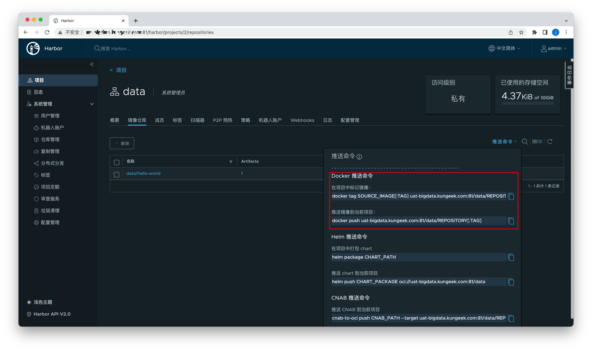

# Harbor

Docker开源了其 registry 实现，目前已经成为 CNCF 的沙箱项目Distribution。不过，Distribution 项目仅仅实现了对镜像存储的支持，对企业级的一些管理诉求并无法提供支持。

为了实现企业级镜像仓库的支持，Harbor 项目应运而生，Harbor由 VMware 公司中国研发中心云原生实验室原创，并于 2016 年 3 月开源。Harbor 在 Docker Distribution的基础上增加了企业用户必需的权限控制、镜像签名、安全漏洞扫描和远程复制等重要功能，还提供了图形管理界面及面向国内用户的中文支持，开源后迅速在中国开发者和用户社区流行，成为中国云原生用户的主流容器镜像仓库。

## 安装

Harbor的依赖较多，在物理机安装较为复杂， 所以官方为Harbor所有组件提供了Docker容器的安装方式，通过Docker Compose进行安装。

（本文以HTTP方式进行演示，生产中需要使用HTTPS）

1. [点此下载](https://github.com/goharbor/harbor/releases)安装包

   有online和offline两个版本，online版本会在安装的时候去docker镜像库拉取镜像，速度很慢，推荐使用offline版本，即下载`harbor-offline-installer-v2.5.2.tgz`。

2. 上传解压

   上传下载好的压缩包到服务器，并解压。

   ```
   $ tar xzvf harbor-offline-installer-v2.5.2.tgz
   ```

3. 前置环境

   - Docker

     ```
     $ docker --version
     ```

   - Docker Compose（docker容器编排容器，解决有依赖关系的多个容器的管理）

     ```
     $ docker-compose --version
     ```

   具体需要的版本[点此查看](https://goharbor.io/docs/2.5.0/install-config/installation-prereqs/)。

4. 修改配置

   复制配置模版

   ```
   $ cp harbor.yml.tmpl harbor.yml
   ```

   修改配置

   ```yml
   # 外部访问的host或IP,不要设置为localhost/127.0.0.1
   hostname: host-example.com
   http:
     # 访问端口，默认是80端口，如果被占用则改为其他端口 
     port: 81
   # 测试环境，不开  启https，将此部分注释掉
   # https:
     # port: 443
     # certificate: /xxx;
     # private_key: /xxx;
   # 修改admin登录密码
   harbor_admin_password: xxxxxx
   ```

5. 安装

   执行如下脚本即可安装并启动Harbor：

   ```
   $ sudo ./install.sh
   ```

   会看到启动了很多docker镜像：

   ```
   $ docker ps
   goharbor/harbor-jobservice:v2.5.2
   goharbor/nginx-photon:v2.5.2
   goharbor/harbor-core:v2.5.2
   goharbor/harbor-registryctl:v2.5.2
   goharbor/harbor-db:v2.5.2
   goharbor/harbor-portal:v2.5.2
   goharbor/registry-photon:v2.5.2
   goharbor/redis-photon:v2.5.2
   goharbor/harbor-log:v2.5.2
   ```

## 使用

安装完毕之后访问地址、输入账户密码即可登录：

```
host-example.com:81
```


后续的启动关闭命令：

**启动应用**

```
$ docker-compose start
```

（在docker-compose.yml目录下执行，下同）

**关闭应用**

```
$ docker-compose stop
```

### 发布镜像到私有仓库

1. 在私有仓库创建项目，例如起名为data

2. 在本地拉取hello-word镜像（模拟制作镜像），并打tag：v1

   ```
   $ docker tag hello-world host-example:81/data/hello-world:v1
   ```

3. 登录

   ```
   $ docker login http://host-example:81 -u admin -p xxxxxx
   ```

4. 推送

   ```
   $ docker push host-example:81/data/hello-world:v1
   ```

5. 现在即会在私有仓库看到hello-world镜像：

   

6. 退出登录

   ```
   $ docker logout http://host-example:81
   ```

**注意：**

1. 登录时可能会报如下错误：

   ```
   Error response from daemon: Get "https://host-example.com:81/v2/": http: server gave HTTP response to HTTPS client
   ```

   也就是说让你用https的方式。

   需要如下处理：

   ```
   #下面为Linux位置, mac位置在~/.docker/daemon.json
   $ vim /etc/docker/daemon.json
   {
    "registry-mirrors": ["https://719wavvz.mirror.aliyuncs.com"],
    "insecure-registries": ["host-example.com:81"],
    "live-restore": true
   }
   ```

   然后重启docker：

   ```
   $ systemctl daemon-reload
   $ systemctl restart docker
   ```

   查看docker  info：

   ```
   $ docker info
   ```

   看到如下信息即可：

   ```
   Insecure Registries:
    hubproxy.docker.internal:5000
    host-example.com:81
    127.0.0.0/8
   ```

2. 打标签名，必须为此格式

   ```
   host/project/REPOSITORY[:TAG]
   ```

   否则，则会报如下错误：

   ```
   errors:
   denied: requested access to the resource is denied
   unauthorized: authentication required
   ```
   
   具体打标签的格式/push/pull的y语句格式可以**参考Harbor操作页面**：
   
   

### 拉取镜像

测试拉取刚刚推送的镜像：

1. 登录

   ```
   $ docker login http://host-example:81 -u admin -p xxx
   ```

2. 拉取

   ```
   $ docker pull host-example:81/data/hello-world:v4
   ```

3. 看到拉取成功

   ```
   $ docker images
   REPOSITORY                                    TAG       IMAGE ID       CREATED        SIZE
   host-example:81/data/hello-world   v4        feb5d9fea6a5   9 months ago   13.3kB
   ```

## References

1. https://goharbor.io/docs/2.5.0/install-config/
2. https://my.oschina.net/vmwareharbor/blog/650964